# Autofee Flow Diagram (EN)

This diagram summarizes the main per-channel Autofee decision flow.

It is not a substitute for the code, but it helps visualize the order of:
- references and signals
- channel classification
- target calculation
- special modes
- floors and locks
- caps/cooldown
- final apply/keep decision

```mermaid
flowchart TD
    A[Start Autofee run] --> B[Load config, operation mode, profile, and persisted state]
    B --> C[Collect node and channel context]
    C --> C1[Capacity, balances, local ratio, outnorm]
    C1 --> C2[Forwards and rebalance windows: 1d, 7d, 21d]
    C2 --> C3[HTLC signals and Amboss seed]
    C3 --> D[Build references]
    D --> D1[out_ppm7d]
    D1 --> D2[rebal_ppm7d or rebalance floor]
    D2 --> D3[seed with guardrails and fallbacks]
    D3 --> E[Classify channel]
    E --> E1[sink, source, router, or unknown]
    E1 --> E2[drained, balanced, full]
    E2 --> E3[trend, margin, rev_share, top-rev]
    E3 --> F[Compute raw Balanced target]
    F --> F1[seed + outrate + trend + HTLC + profitability]
    F1 --> G{Operation mode}
    G -->|Balanced| H[Apply Balanced controls]
    G -->|Market refill| I[Apply Market refill premium]
    H --> H1[discovery]
    H1 --> H2[explorer]
    H2 --> H3[drained-explorer]
    H3 --> H4[rescue]
    I --> I1[use Balanced target as strong base]
    I1 --> I2[ignore rebalance as primary target driver]
    I2 --> I3[derive inbound from outbound]
    H4 --> J[Build floor stack]
    I3 --> J
    J --> J1[rebal or rebal-sink]
    J1 --> J2[outrate floor]
    J2 --> J3[peg]
    J3 --> J4[revfloor, stagnation, no-signal]
    J4 --> K[Apply locks and relaxations]
    K --> K1[global-neg-lock]
    K1 --> K2[profit-protect]
    K2 --> K3[floor-lock or rescue-floor-relax]
    K3 --> L[Apply caps and hysteresis]
    L --> L1[step cap]
    L1 --> L2[reversal guard]
    L2 --> L3[cooldown]
    L3 --> M[Compute final outbound]
    M --> N[Compute final inbound discount]
    N --> O{Policy changed?}
    O -->|Yes| P[Apply fees and record set]
    O -->|No| Q[Record keep or same-ppm]
    P --> R[Persist state and format Results/Telegram]
    Q --> R
```

## Quick reading

- `Balanced` and `Market refill` share the same signal base, then diverge after the raw Balanced target.
- `Market refill` uses the Balanced target as its main reference, adds a controlled premium, and makes inbound follow outbound.
- `Rescue` and `drained-explorer` are special `Balanced` behaviors, not `Market refill` behaviors.
- A channel only gets a `set` after passing floors, locks, caps, hysteresis, and cooldown.

## Useful links

- General Autofee docs: [README.md](/d:/Users/jaime/OneDrive/Documentos/Code%20Projects/brln-os-light/README.md)
- Tag glossary: [AUTOFEE_TAG_GLOSSARY_EN.md](/d:/Users/jaime/OneDrive/Documentos/Code%20Projects/brln-os-light/docs/AUTOFEE_TAG_GLOSSARY_EN.md)
