# Diagrama de Fluxo do Autofee (PT-BR)

Este diagrama resume o fluxo principal de decisao do Autofee por canal.

Ele nao substitui o codigo, mas ajuda a entender a ordem dos blocos:
- referencias e sinais
- classificacao do canal
- calculo de target
- modos especiais
- floors e locks
- caps/cooldown
- decisao final

```mermaid
flowchart TD
    A[Iniciar rodada do Autofee] --> B[Carregar config, modo, perfil e estado persistido]
    B --> C[Coletar contexto do node e do canal]
    C --> C1[Capacidade, balances, local ratio, outnorm]
    C1 --> C2[Forwards e rebalance por 1d, 7d, 21d]
    C2 --> C3[Sinais HTLC e seed Amboss]
    C3 --> D[Montar referencias]
    D --> D1[out_ppm7d]
    D1 --> D2[rebal_ppm7d ou rebal floor]
    D2 --> D3[seed com guardrails e fallbacks]
    D3 --> E[Classificar canal]
    E --> E1[sink, source, router ou unknown]
    E1 --> E2[drained, balanced, full]
    E2 --> E3[tendencia, margem, rev_share, top-rev]
    E3 --> F[Calcular target bruto do Balanced]
    F --> F1[seed + outrate + trend + HTLC + lucro]
    F1 --> G{Modo operacional}
    G -->|Balanced| H[Aplicar controles do Balanced]
    G -->|Market refill| I[Aplicar premium do Market refill]
    H --> H1[discovery]
    H1 --> H2[explorer]
    H2 --> H3[drained-explorer]
    H3 --> H4[rescue]
    I --> I1[usar target do Balanced como base forte]
    I1 --> I2[ignorar rebalance como driver principal]
    I2 --> I3[derivar inbound da outbound]
    H4 --> J[Construir stack de floors]
    I3 --> J
    J --> J1[rebal ou rebal-sink]
    J1 --> J2[outrate floor]
    J2 --> J3[peg]
    J3 --> J4[revfloor, stagnation, no-signal]
    J4 --> K[Aplicar locks e relaxamentos]
    K --> K1[global-neg-lock]
    K1 --> K2[profit-protect]
    K2 --> K3[floor-lock ou rescue-floor-relax]
    K3 --> L[Aplicar caps e histerese]
    L --> L1[step cap]
    L1 --> L2[reversal guard]
    L2 --> L3[cooldown]
    L3 --> M[Calcular outbound final]
    M --> N[Calcular inbound discount final]
    N --> O{Mudou policy?}
    O -->|Sim| P[Aplicar fees e registrar set]
    O -->|Nao| Q[Registrar keep ou same-ppm]
    P --> R[Persistir estado e formatar Results/Telegram]
    Q --> R
```

## Leitura rapida

- `Balanced` e `Market refill` compartilham a mesma base de sinais, mas divergem depois do `target bruto do Balanced`.
- `Market refill` usa o `Balanced` como referencia principal, aplica um premium controlado e deixa o inbound acompanhar a outbound.
- `Rescue` e `drained-explorer` sao comportamentos especiais do `Balanced`, nao do `Market refill`.
- O canal so recebe `set` depois de passar por floors, locks, caps, histerese e cooldown.

## Atalhos uteis

- Documentacao geral do Autofee: [README-PT-BR.md](/d:/Users/jaime/OneDrive/Documentos/Code%20Projects/brln-os-light/docs/README-PT-BR.md)
- Glossario de tags: [AUTOFEE_TAG_GLOSSARIO_PT_BR.md](/d:/Users/jaime/OneDrive/Documentos/Code%20Projects/brln-os-light/docs/AUTOFEE_TAG_GLOSSARIO_PT_BR.md)
